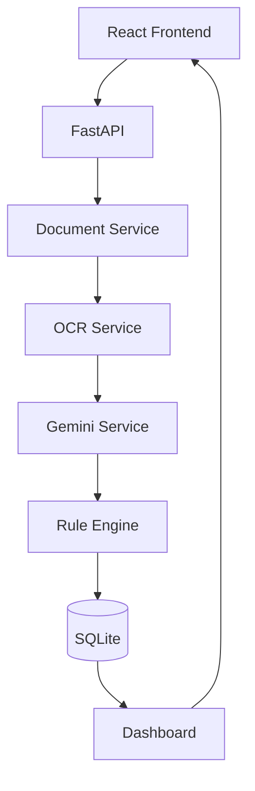
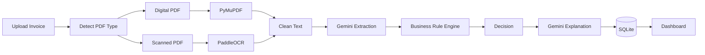

# 02_System_Architecture.md

# FinanceFlow AI – System Architecture

Version: 1.0

---

# Purpose

This document defines the technical architecture of FinanceFlow AI. The system is designed using a hybrid AI approach where AI performs semantic extraction and explanation, while deterministic Python code performs all financial validation and approval decisions.

---

# Architecture Principles

1. AI assists, never decides.
2. Every decision is explainable.
3. Every processing step is observable.
4. Business rules are deterministic.
5. Services are modular.
6. Optimize LLM usage.

---

# High-Level Architecture

---

# Processing Pipeline

---

# Service Responsibilities

## Frontend

Responsible for:

- Upload UI
- Dashboard
- Invoice History
- Processing Timeline
- Invoice Details
- Error Handling

No business logic.

---

## FastAPI

Responsible for:

- API routing
- Validation
- Service orchestration
- File management
- Exception handling

---

## Document Service

Responsibilities

- Save upload
- Detect PDF type
- Route to extraction pipeline

Outputs

- Document metadata
- Processing job

---

## OCR Service

Digital PDFs

- PyMuPDF
- pdfplumber fallback

Scanned PDFs

- PaddleOCR

Outputs

- Plain text
- OCR confidence

---

## Gemini Service

Responsibilities

- Extract structured JSON
- Generate explanation

Never decides approval.

---

## Rule Engine

Checks

- Vendor exists
- Purchase Order exists
- Duplicate invoice
- GST validity
- Currency
- Date
- Amount tolerance
- Required fields

Outputs

- PASS/FAIL per rule
- Final status

---

## Decision Engine

Possible decisions

- APPROVED
- REJECTED
- PENDING MANUAL REVIEW

---

## History Service

Stores

- Extracted JSON
- Rule evaluation
- Timeline
- Decision
- Explanation
- Processing time

---

# Request Lifecycle

1. User uploads invoice.
2. Backend stores file.
3. Detect digital vs scanned.
4. Extract text.
5. Normalize text.
6. Gemini converts text to JSON.
7. Rule engine validates.
8. Decision generated.
9. Gemini writes explanation.
10. Results stored.
11. Dashboard updated.

---

# Error Recovery

| Failure | Recovery |
|---------|----------|
| OCR fails | Manual Review |
| Gemini timeout | Retry once |
| Invalid JSON | Retry with stricter prompt |
| Corrupted PDF | Reject upload |
| Missing PO | Pending Review |

---

# Security

- Gemini API key stored in environment variables.
- Validate MIME type before processing.
- Limit upload size.
- Store only metadata required for history.
- Sanitize filenames.

---

# Scalability

Current

React → FastAPI → SQLite

Future

React

↓

FastAPI

↓

Redis Queue

↓

Celery Workers

↓

PostgreSQL

↓

S3 Storage

↓

SAP / Oracle ERP Integrations

---

# Acceptance Criteria

- Modular services.
- Automatic document detection.
- Hybrid OCR pipeline.
- Gemini used only for extraction/explanation.
- Rule engine independent of AI.
- Complete processing history.
- Dashboard reflects latest state.

---

# Antigravity Build Prompt

Build the backend architecture exactly as specified.

Create independent services:

- document_service.py
- ocr_service.py
- gemini_service.py
- validation_service.py
- decision_service.py
- history_service.py

Use dependency injection where practical.

No business rules should exist inside React components or Gemini prompts.

Maintain clean architecture with reusable services and typed models.
