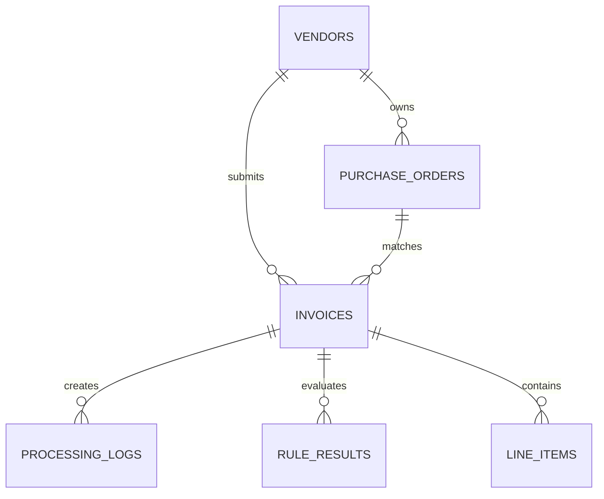

# 03_Database_Design.md

# FinanceFlow AI – Database Design

Version: 1.0

---

# Purpose

This document defines the relational database schema for FinanceFlow AI. The schema is optimized for:

- Invoice processing
- Auditability
- Rule evaluation
- Analytics
- Future ERP integrations

SQLite is used for the MVP, but the schema is designed to migrate easily to PostgreSQL.

---

# Design Principles

- Normalize core entities.
- Preserve every processing run.
- Never overwrite historical decisions.
- Keep AI output separate from business rules.
- Store enough metadata for audit and debugging.

---

# Entity Relationship Diagram



---

# Tables

## vendors

| Column | Type | Notes |
|---|---|---|
| id | INTEGER PK | Auto increment |
| vendor_name | TEXT | Unique |
| gst_number | TEXT | Indexed |
| bank_account | TEXT | |
| status | TEXT | APPROVED / BLACKLISTED |
| created_at | DATETIME | |

Indexes

- vendor_name
- gst_number

---

## purchase_orders

| Column | Type |
|---|---|
| id | INTEGER PK |
| po_number | TEXT UNIQUE |
| vendor_id | FK vendors.id |
| amount | REAL |
| currency | TEXT |
| status | TEXT |
| created_at | DATETIME |

---

## invoices

Stores one record per processed invoice.

| Column | Type |
|---|---|
| id | INTEGER PK |
| invoice_number | TEXT |
| vendor_id | FK |
| po_id | FK |
| invoice_date | DATE |
| subtotal | REAL |
| tax | REAL |
| shipping | REAL |
| total | REAL |
| currency | TEXT |
| status | TEXT |
| document_type | TEXT |
| extraction_confidence | REAL |
| processing_time_ms | INTEGER |
| explanation | TEXT |
| created_at | DATETIME |

Status values

- APPROVED
- REJECTED
- PENDING_MANUAL_REVIEW

---

## line_items

| Column | Type |
|---|---|
| id | INTEGER PK |
| invoice_id | FK |
| description | TEXT |
| quantity | REAL |
| unit_price | REAL |
| amount | REAL |

---

## rule_results

One row per executed rule.

| Column | Type |
|---|---|
| id | INTEGER PK |
| invoice_id | FK |
| rule_name | TEXT |
| result | TEXT |
| expected | TEXT |
| actual | TEXT |
| message | TEXT |
| evaluated_at | DATETIME |

Example rules

- Vendor Exists
- PO Exists
- Duplicate Invoice
- GST Validation
- Amount Tolerance
- Currency Match

---

## processing_logs

Stores execution timeline.

| Column | Type |
|---|---|
| id | INTEGER PK |
| invoice_id | FK |
| stage | TEXT |
| status | TEXT |
| duration_ms | INTEGER |
| metadata | TEXT |
| created_at | DATETIME |

Stages

- Upload
- Detection
- OCR
- Extraction
- Validation
- Decision
- Save

---

# Suggested SQLAlchemy Models

```
Vendor
PurchaseOrder
Invoice
InvoiceLineItem
RuleResult
ProcessingLog
```

---

# Seed Data

Generate using Faker

- 40 Vendors
- 200 Purchase Orders
- 100 Historical Invoices

Rules

- Random currencies
- Realistic GST numbers
- Mixed approved/rejected invoices

---

# Sample Invoice Record

```json
{
  "invoice_number":"INV-2026-104",
  "vendor":"ABC Industries",
  "po_number":"PO-10023",
  "total":98450,
  "currency":"INR",
  "status":"APPROVED",
  "processing_time_ms":2840
}
```

---

# Analytics Queries

Examples

- Approval rate
- Average processing time
- Top vendors
- Duplicate invoice count
- Manual review percentage
- OCR confidence trend

---

# Migration Strategy

Current

SQLite

Future

PostgreSQL

No schema redesign required.

---

# Acceptance Criteria

- All entities normalized.
- Foreign keys enforced.
- Processing history preserved.
- Rule evaluations queryable.
- Timeline reproducible.
- Ready for SQLAlchemy ORM.

---

# Antigravity Build Prompt

Create SQLAlchemy models and Alembic-ready schema for every table defined above.

Generate:

- models/
- schemas/
- CRUD helpers
- seed.py

Seed realistic sample data using Faker and maintain referential integrity.
