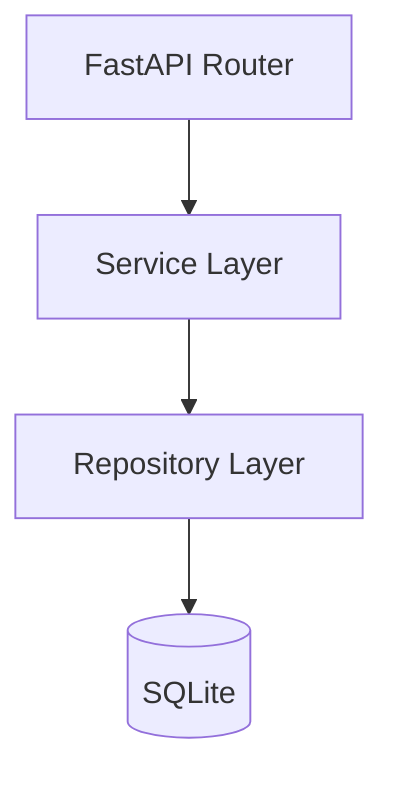
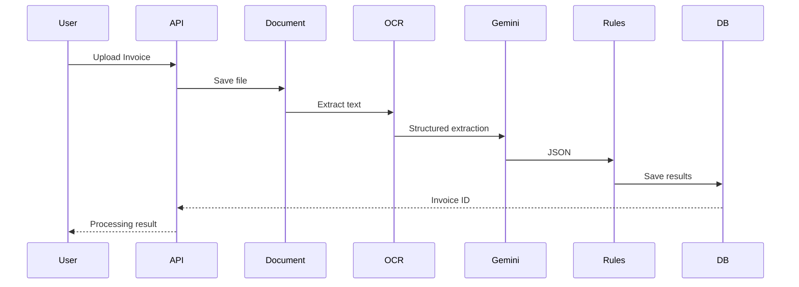

# 04_Backend_Architecture.md

# FinanceFlow AI – Backend Architecture

Version: 1.0

---

# Purpose

This document defines the backend architecture for FinanceFlow AI. The backend is built with FastAPI using a clean, service-oriented architecture. The goal is to keep business logic modular, testable, and independent of the web framework.

---

# Technology Stack

- Python 3.12
- FastAPI
- SQLAlchemy
- Alembic
- SQLite (MVP)
- Pydantic v2
- PaddleOCR
- PyMuPDF
- pdfplumber
- Google Gemini 2.5 Flash

---

# Folder Structure

```text
backend/
├── api/
│   ├── invoices.py
│   ├── dashboard.py
│   ├── history.py
│   └── health.py
├── core/
│   ├── config.py
│   ├── logging.py
│   └── security.py
├── database/
│   ├── session.py
│   ├── base.py
│   └── seed.py
├── models/
├── schemas/
├── repositories/
├── services/
│   ├── document_service.py
│   ├── ocr_service.py
│   ├── gemini_service.py
│   ├── validation_service.py
│   ├── decision_service.py
│   ├── explanation_service.py
│   └── dashboard_service.py
├── utils/
├── uploads/
├── tests/
└── main.py
```

---

# Clean Architecture



Rules:

- Routers never access the database directly.
- Services contain business logic.
- Repositories contain SQLAlchemy queries.
- Models represent persistence.
- Schemas represent API contracts.

---

# Request Flow



---

# Routers

## invoices.py

Responsibilities

- Upload invoice
- Process invoice
- Get invoice
- Reprocess invoice

## dashboard.py

Responsibilities

- Metrics
- Charts
- Recent invoices

## history.py

Responsibilities

- Search
- Filters
- Timeline

## health.py

Responsibilities

- Health check
- Version

---

# Service Layer

## document_service.py

- Save uploads
- Detect document type
- Generate metadata

## ocr_service.py

- Digital PDF extraction
- OCR fallback
- Confidence calculation

## gemini_service.py

- Build prompts
- Parse JSON
- Retry invalid responses

## validation_service.py

Validate:

- Vendor
- PO
- GST
- Currency
- Amount
- Dates
- Duplicate invoice

## decision_service.py

Combine rule outcomes into:

- APPROVED
- REJECTED
- PENDING_MANUAL_REVIEW

## explanation_service.py

Generate concise business explanation after decision.

---

# Repository Layer

Repositories encapsulate all SQLAlchemy operations.

Examples:

- InvoiceRepository
- VendorRepository
- PurchaseOrderRepository
- DashboardRepository

No SQL should exist inside routers.

---

# Pydantic Schemas

Request Models

- UploadInvoiceRequest
- ReprocessRequest

Response Models

- InvoiceResponse
- DashboardResponse
- TimelineResponse
- RuleResultResponse

---

# Error Handling

Return consistent JSON:

```json
{
  "success": false,
  "message": "Purchase Order not found",
  "code": "PO_NOT_FOUND"
}
```

Use FastAPI exception handlers for:

- ValidationError
- HTTPException
- UnexpectedException

---

# Configuration

Environment variables:

```text
GEMINI_API_KEY=
DATABASE_URL=
UPLOAD_DIR=
MAX_UPLOAD_SIZE_MB=20
OCR_CONFIDENCE_THRESHOLD=70
PO_TOLERANCE_PERCENT=5
```

---

# Logging

Log:

- Request ID
- Processing stages
- Duration
- Exceptions
- Gemini latency

---

# Acceptance Criteria

- Clean separation of concerns.
- Modular services.
- Typed request/response models.
- Repository pattern implemented.
- Configuration via environment variables.
- Ready for future PostgreSQL migration.

---

# Antigravity Build Prompt

Generate the complete FastAPI backend using the architecture above.

Requirements:

- Async FastAPI
- SQLAlchemy ORM
- Pydantic v2
- Repository pattern
- Service-oriented architecture
- Dependency injection where appropriate
- Production-ready logging
- Centralized exception handling
- Modular routers
- Type hints throughout
