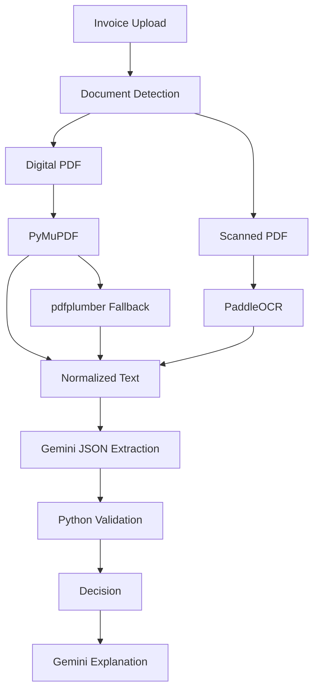

# 05_AI_OCR_Architecture.md

# FinanceFlow AI – AI & OCR Architecture

Version: 1.0

---

# Purpose

This document defines the complete document intelligence pipeline used by FinanceFlow AI.

The guiding principle is:

> **Use deterministic software whenever possible. Use AI only where semantic understanding is required.**

This minimizes hallucinations, reduces cost, improves explainability, and mirrors production enterprise AI systems.

---

# Objectives

- Automatically support digital and scanned invoices
- Extract structured invoice information
- Minimize Gemini token usage
- Produce deterministic downstream decisions
- Surface confidence and uncertainty
- Enable future multilingual support

---

# Hybrid AI Architecture



---

# Document Type Detection

Algorithm

1. Attempt embedded text extraction with PyMuPDF.
2. If extracted text length > threshold (e.g. 100 characters), classify as Digital PDF.
3. Otherwise classify as Scanned PDF.
4. Run PaddleOCR only for scanned documents.

No user interaction is required.

---

# Digital Invoice Pipeline

1. Upload PDF
2. Extract text using PyMuPDF
3. Fallback to pdfplumber if needed
4. Normalize whitespace and line breaks
5. Send normalized text to Gemini

Advantages

- Faster
- Cheaper
- More accurate than OCR
- Preserves formatting

---

# Scanned Invoice Pipeline

1. Convert PDF pages to images
2. Preprocess images
3. Run PaddleOCR
4. Merge page text
5. Normalize output
6. Send to Gemini

---

# OCR Preprocessing

Recommended steps

- Deskew
- Denoise
- Increase contrast
- Resize low-resolution images
- Preserve aspect ratio

These steps improve OCR accuracy.

---

# OCR Confidence

Store:

- Overall confidence
- Field confidence (future)

Threshold

- >=70 → continue
- <70 → Manual Review recommendation

Confidence should be persisted in the invoices table.

---

# Gemini Responsibilities

Gemini is responsible only for:

- Understanding document structure
- Extracting structured fields
- Explaining final decisions

Gemini must never:

- Approve invoices
- Reject invoices
- Apply finance policy

---

# Extraction Prompt Strategy

System Prompt

"You are an invoice information extraction engine.

Extract structured information only.

Return valid JSON.

Do not include markdown.

Do not infer missing values."

Requested fields

- Vendor Name
- Invoice Number
- Invoice Date
- Purchase Order
- GST Number
- Currency
- Subtotal
- Tax
- Shipping
- Grand Total
- Payment Terms
- Vendor Address
- Line Items

---

# Expected JSON

```json
{
  "vendor_name": "",
  "invoice_number": "",
  "invoice_date": "",
  "purchase_order": "",
  "gst_number": "",
  "currency": "INR",
  "subtotal": 0,
  "tax": 0,
  "shipping": 0,
  "grand_total": 0,
  "payment_terms": "",
  "vendor_address": "",
  "line_items": []
}
```

---

# JSON Validation

Validate:

- Required keys exist
- Numeric fields are numbers
- Dates parse correctly
- Currency exists
- Arrays are valid

Retry Gemini once if validation fails.

---

# Hallucination Prevention

- Never send images directly if text is available.
- Never ask Gemini for approval decisions.
- Reject fabricated PO numbers.
- Treat missing fields as null.
- Validate everything in Python.

---

# Cost Optimization

Only one extraction request per invoice.

One explanation request after validation.

Never call Gemini inside rule evaluation.

Cache prompts for development where practical.

---

# Multi-page Invoices

- Process all pages
- Merge extracted text
- Preserve page order
- Send combined normalized text to Gemini

---

# Future Enhancements

- Layout-aware extraction
- Vision models
- Multi-language OCR
- Signature detection
- Stamp detection
- Fraud anomaly detection

---

# Acceptance Criteria

- Automatic document detection
- OCR only when required
- Valid structured JSON
- Confidence recorded
- Python validates extracted values
- Gemini never makes approval decisions

---

# Antigravity Build Prompt

Implement a modular document intelligence pipeline.

Create:

- document_detector.py
- pdf_extractor.py
- ocr_service.py
- gemini_service.py
- json_validator.py

Requirements:

- Automatic digital/scanned detection
- PyMuPDF first
- pdfplumber fallback
- PaddleOCR for scanned documents
- Gemini extraction using structured JSON
- Retry invalid JSON once
- Log processing duration
- Return extraction confidence and normalized output
