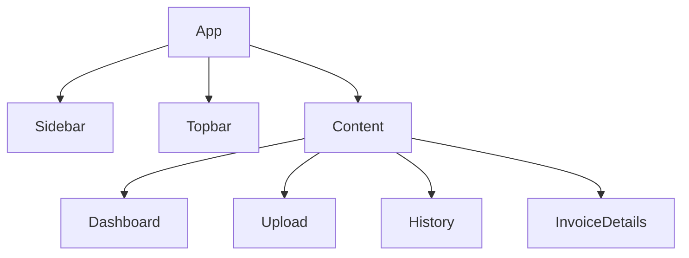

# 07_Frontend_Architecture.md

# FinanceFlow AI – Frontend Architecture

Version: 1.0

---

# Purpose

This document defines the frontend architecture for FinanceFlow AI. The application is built with React, Vite, TypeScript, Tailwind CSS and shadcn/ui. The UI should resemble a modern enterprise SaaS dashboard while remaining simple enough to build within two days.

---

# Technology Stack

- React 19
- Vite
- TypeScript
- Tailwind CSS
- shadcn/ui
- React Query
- React Router
- React Hook Form
- Framer Motion
- Recharts
- Lucide Icons

---

# Folder Structure

```text
frontend/
├── src/
│   ├── app/
│   ├── pages/
│   │   ├── dashboard/
│   │   ├── upload/
│   │   ├── history/
│   │   └── invoice/
│   ├── components/
│   │   ├── layout/
│   │   ├── dashboard/
│   │   ├── upload/
│   │   ├── invoice/
│   │   ├── timeline/
│   │   └── common/
│   ├── services/
│   ├── hooks/
│   ├── types/
│   ├── lib/
│   └── assets/
```

---

# Routes

| Route | Purpose |
|-------|---------|
| / | Dashboard |
| /upload | Upload invoice |
| /history | Invoice history |
| /invoice/:id | Invoice details |

---

# Layout



---

# Shared Components

- AppLayout
- Sidebar
- Header
- PageTitle
- MetricCard
- StatusBadge
- EmptyState
- ErrorState
- LoadingSkeleton
- SearchBar
- DataTable

---

# Dashboard

Widgets

- Total Invoices
- Approved
- Pending
- Rejected
- Avg Processing Time

Charts

- Approval Rate
- Processing Trend

Table

- Recent Invoices

---

# Upload Page

Components

- DragDropUploader
- FilePreview
- UploadProgress
- ProcessButton

UX

- Drag & drop
- File validation
- Progress animation
- Toast notifications

---

# Processing Timeline

Timeline steps

1. Upload
2. Detect Document
3. OCR / PDF Extraction
4. Gemini Extraction
5. Rule Validation
6. Decision
7. Save Complete

Each step should animate as it completes.

---

# Invoice Details

Two-column layout

Left

- PDF Preview

Right

- Extracted Fields
- Rule Results
- Decision Card
- AI Explanation
- Processing Timeline

---

# Invoice History

Features

- Search
- Filter by status
- Filter by document type
- Pagination
- Click row to view details

---

# State Management

React Query

Queries

- dashboard
- invoices
- invoiceDetails

Mutations

- uploadInvoice
- reprocessInvoice

---

# API Layer

services/api.ts

Expose

- uploadInvoice()
- getDashboard()
- getInvoices()
- getInvoice()
- reprocessInvoice()

No fetch logic inside components.

---

# Loading & Error States

Every page must include:

- Skeleton loading
- Empty state
- Retry button
- Error message

---

# Responsive Design

Desktop: Sidebar

Tablet: Collapsible sidebar

Mobile: Drawer navigation

Minimum width: 320px

---

# Acceptance Criteria

- Responsive layout
- Shared components
- Centralized API layer
- React Query for data
- Accessible forms
- Timeline animations
- Modern SaaS appearance

---

# Antigravity Build Prompt

Generate the React frontend using the architecture above.

Requirements:

- React + Vite + TypeScript
- Tailwind + shadcn/ui
- React Query
- React Router
- Modular components
- Reusable cards and tables
- Responsive layout
- Framer Motion animations
- Clean separation between UI and API layer
