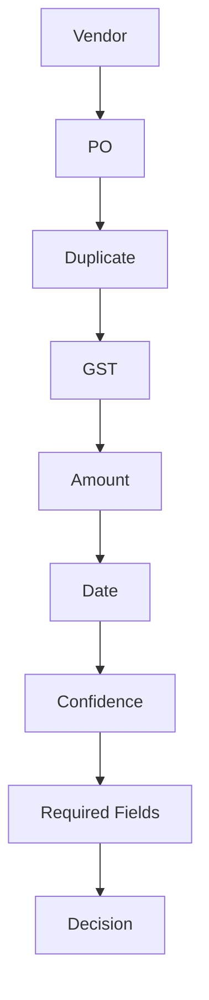

# 09_Business_Rule_Engine.md

# FinanceFlow AI – Business Rule Engine

Version: 1.0

---

# Purpose

The Rule Engine is the authoritative source for every approval decision in FinanceFlow AI.

Gemini **never** approves or rejects invoices.

Gemini only extracts structured data and generates a human-readable explanation **after** the rule engine has produced the decision.

---

# Core Philosophy

```
PDF
   ↓
OCR / Text Extraction
   ↓
Gemini → Structured JSON
   ↓
Python Rule Engine
   ↓
Decision
   ↓
Gemini Explanation
```

All financial policy is implemented in deterministic Python code.

---

# Rule Categories

## Vendor Validation

Checks

- Vendor exists
- Vendor approved
- Vendor blacklisted

Results

PASS

FAIL

WARNING

---

## Purchase Order Validation

Checks

- PO exists
- Vendor matches PO
- Currency matches
- PO status = OPEN

Failure

Pending Review

---

## Duplicate Invoice Rule

Compare

- Vendor
- Invoice Number

If duplicate exists

Decision

REJECTED

Reason

Duplicate Invoice Detected

---

## GST Validation

Checks

- GST present
- Format valid
- Matches vendor record

Failure

Pending Manual Review

---

## Amount Validation

Formula

Difference %

= abs(invoice-po)/po ×100

Tolerance

Default

5%

Within tolerance

PASS

Above tolerance

REJECTED

---

## Date Validation

Checks

- Invoice date exists
- Not future dated
- Not older than configurable threshold (default 365 days)

---

## OCR Confidence

Confidence >= 70%

PASS

Below threshold

Pending Manual Review

---

## Required Fields

Required

- Vendor
- Invoice Number
- Invoice Date
- PO Number
- Grand Total

Missing any critical field

Pending Manual Review

---

# Rule Execution Order



---

# Decision Matrix

| Condition | Decision |
|-----------|----------|
| All rules pass | APPROVED |
| Duplicate invoice | REJECTED |
| Amount above tolerance | REJECTED |
| Blacklisted vendor | REJECTED |
| Missing PO | PENDING_MANUAL_REVIEW |
| Low OCR confidence | PENDING_MANUAL_REVIEW |
| Missing required fields | PENDING_MANUAL_REVIEW |
| Invalid GST | PENDING_MANUAL_REVIEW |

---

# Rule Result Object

```json
{
  "rule":"Amount Tolerance",
  "status":"PASS",
  "expected":"<=5%",
  "actual":"2.4%",
  "message":"Invoice is within tolerance."
}
```

---

# Processing Example

Invoice Uploaded

↓

Vendor Exists ✅

↓

PO Exists ✅

↓

Duplicate ❌ No duplicate

↓

GST Valid ✅

↓

Amount Difference 1.8% ✅

↓

Decision

APPROVED

---

# Configurable Settings

```text
PO_TOLERANCE_PERCENT=5

OCR_CONFIDENCE_THRESHOLD=70

MAX_INVOICE_AGE_DAYS=365

REQUIRE_GST=true

REQUIRE_PO=true
```

Read from environment variables or configuration.

---

# Audit Logging

Persist for every rule

- Rule name
- Expected value
- Actual value
- Result
- Timestamp
- Invoice ID

Never overwrite historical evaluations.

---

# Future Enhancements

- Rule versioning
- Dynamic rule editor
- Customer-specific policies
- ML-assisted anomaly detection
- Fraud scoring

---

# Acceptance Criteria

- Deterministic execution
- Repeatable decisions
- Rule-by-rule visibility
- Configurable thresholds
- Full audit history
- Independent of Gemini

---

# Antigravity Build Prompt

Implement a modular Python rule engine.

Create:

- base_rule.py
- vendor_rule.py
- po_rule.py
- duplicate_rule.py
- gst_rule.py
- amount_rule.py
- date_rule.py
- confidence_rule.py
- required_fields_rule.py
- decision_engine.py

Requirements

- One class per rule
- Shared interface
- Aggregate results
- Return structured rule outcomes
- Produce APPROVED, REJECTED, or PENDING_MANUAL_REVIEW
- Persist every rule evaluation to the database
