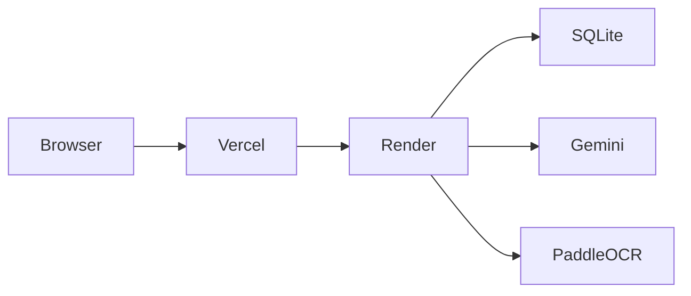

# 13_Deployment.md

# FinanceFlow AI – Deployment Guide

Version: 1.0

---

# Purpose

This document describes how to deploy FinanceFlow AI for the interview demo.

The deployment prioritizes:

- Reliability
- Simplicity
- Free hosting
- Fast recovery
- Easy debugging

Recommended Stack

Frontend

- Vercel

Backend

- Render

Database

- SQLite (bundled with backend)

AI

- Google Gemini API

---

# Architecture



---

# Repository Structure

```text
FinanceFlow-AI/

frontend/

backend/

docs/

sample_data/

.env.example
```

---

# Backend Deployment

Platform

Render

Build Command

```bash
pip install -r requirements.txt
```

Start Command

```bash
uvicorn main:app --host 0.0.0.0 --port $PORT
```

Python Version

3.12

---

# Frontend Deployment

Platform

Vercel

Build

```bash
npm install

npm run build
```

Output Folder

```
dist
```

Framework

Vite

---

# Environment Variables

Backend

```text
GEMINI_API_KEY=

DATABASE_URL=sqlite:///financeflow.db

UPLOAD_DIR=uploads

OCR_CONFIDENCE_THRESHOLD=70

PO_TOLERANCE_PERCENT=5
```

Frontend

```text
VITE_API_URL=https://your-render-url.onrender.com/api/v1
```

---

# Production Checklist

Backend

- Health endpoint works
- Upload endpoint works
- Gemini configured
- OCR configured
- Logs enabled

Frontend

- API URL correct
- Upload works
- Dashboard loads
- History loads

---

# Health Check

Endpoint

```
GET /api/v1/health
```

Expected

```json
{
  "status":"healthy",
  "version":"1.0.0"
}
```

---

# Logging

Enable

- Request logs
- Error logs
- Processing duration
- Gemini latency

Store locally for MVP.

---

# Monitoring

Before demo verify:

- Backend uptime
- Frontend accessible
- Gemini quota available
- Sample invoices present

---

# Backup Plan

If Render experiences issues:

Run locally.

Backend

```bash
uvicorn main:app --reload
```

Frontend

```bash
npm run dev
```

Have localhost ready during the interview.

---

# Troubleshooting

## Upload fails

Check

- File size
- MIME type
- Upload directory

---

## OCR fails

Check

- PaddleOCR installation
- PDF readability

---

## Gemini errors

Check

- API key
- Quota
- Network

---

## Database errors

Check

- SQLite permissions
- Migration executed

---

# Demo Preparation

Prepare:

- 1 Digital invoice
- 1 Scanned invoice
- 1 Duplicate invoice
- 1 Missing PO invoice

Open browser tabs

- Dashboard
- Upload
- History

---

# Rollback

If latest deployment fails:

Redeploy previous successful commit.

Maintain git tags for demo-ready versions.

---

# Acceptance Criteria

- Frontend reachable
- Backend reachable
- APIs operational
- Upload functional
- Dashboard populated
- Demo runs without manual fixes

---

# Antigravity Build Prompt

Prepare the project for production deployment.

Tasks

- Create Docker-ready backend (optional)
- Generate .env.example
- Configure Vercel frontend
- Configure Render backend
- Add startup scripts
- Verify production build
- Update README deployment section

The deployed application must be demo-ready on free hosting.
