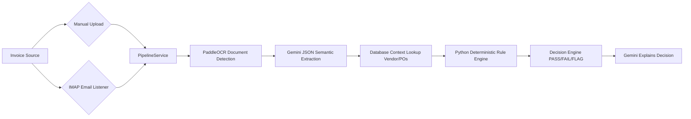

# FinanceFlow AI

> **AI-Powered Accounts Payable Copilot** — Automates invoice processing with OCR, Gemini semantic extraction, and deterministic business rules.


FinanceFlow AI acts as an autonomous clerk for your Accounts Payable department. It reads invoices, extracts line items, validates them against existing Purchase Orders and Vendors, applies strict financial tolerance rules, and intelligently approves or flags invoices for manual review.

## ✨ Key Features

* **Autonomous Email Ingestion**: A built-in IMAP background worker continuously polls your inbox for unread invoices, automatically downloading PDFs and routing them through the AI pipeline 24/7.
* **Deterministic Rule Engine**: AI assists, but never decides. Extraction is handled by Google Gemini 2.5 Flash, but financial decisions (like PO Tolerance, GST Validation, Invoice Age, and Duplicate Detection) are governed by strict Python business rules.
* **Multi-PO Matching**: Automatically detects if an invoice spans multiple open Purchase Orders for a specific vendor and allocates the amounts accordingly.
* **Interactive AP Dashboard**: A stunning React frontend that provides deep insights into processing metrics, rule failures, and a side-by-side "Document Vault" to review extracted fields against the original PDF.
* **Configurable Tolerances**: Adjust business settings on the fly from the dashboard (e.g., Strict Line Items Integrity, Duplicate Detection Windows, Auto-Approval Confidence Thresholds).

## 🏗 Architecture & Pipeline



## 🛠 Tech Stack

| Layer | Technology |
|-------|------------|
| **Frontend** | React 19, Vite, TypeScript, Tailwind CSS, Framer Motion, React Router |
| **Backend** | FastAPI, SQLAlchemy, SQLite, Pydantic |
| **AI & OCR** | Gemini 2.5 Flash, PaddleOCR, PyMuPDF, pdfplumber |
| **Deployment**| Vercel (Frontend), Render.com (Backend API + Persistent Disk) |

## 🚀 Quick Start (Local Development)

### 1. Backend Setup

```bash
cd backend
python -m venv venv
venv\Scripts\activate  # On Windows
# source venv/bin/activate # On macOS/Linux

pip install -r requirements.txt
cp .env.example .env # Add your GEMINI_API_KEY
python -m uvicorn backend.main:app --reload --port 8000
```

### 2. Frontend Setup

```bash
cd frontend
npm install
npm run dev
```

Navigate to `http://localhost:5173` to view the dashboard!

## 🌍 Cloud Deployment (Vercel + Render)

This repository is pre-configured for instant deployment to modern PaaS providers.

1. **Backend to Render**: Connect your GitHub to Render.com and create a new Blueprint using the included `render.yaml`. This provisions a Python Web Service with a persistent disk (for the SQLite database and uploaded PDFs).
2. **Frontend to Vercel**: Import the `frontend` folder into Vercel. Set the `VITE_API_URL` environment variable to your live Render backend URL. Client-side routing is handled automatically by the included `vercel.json`.

## 📜 License

MIT License
